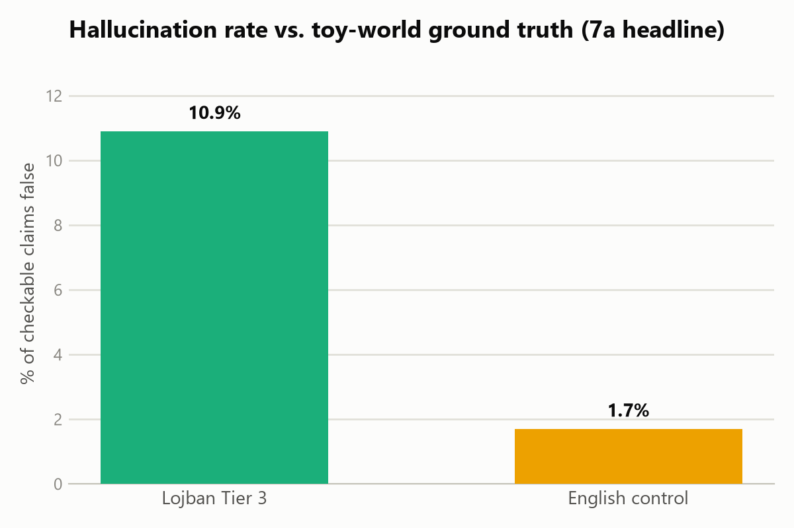
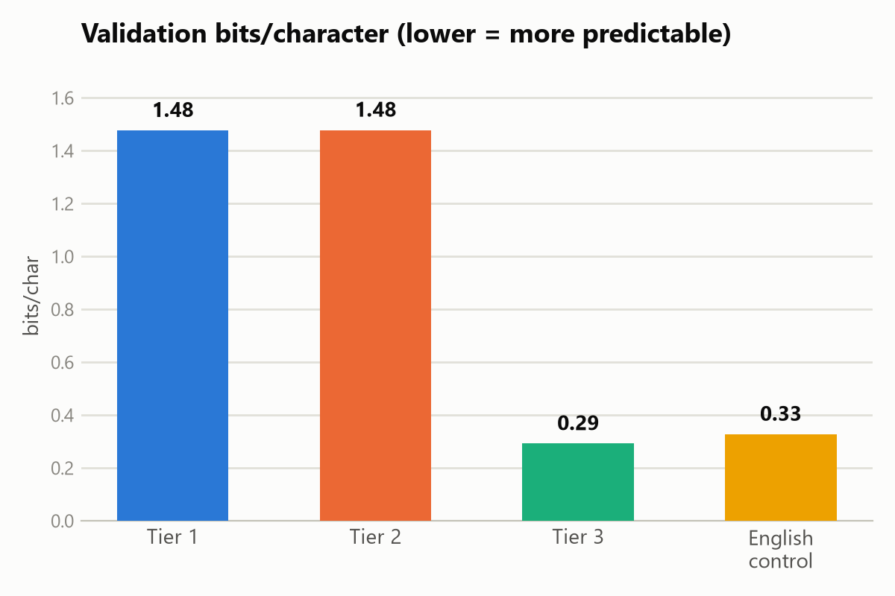

# jetnu

A research project testing whether a zero-ambiguity constructed language
(Lojban) reduces factual hallucination in a small trained language model,
compared to English, given identical underlying facts and corpus size.

## Research question and scope boundary

**This does not aim to show that Lojban, or this method, is "better for
training LLMs" in general.** It tests one narrow, checkable question:
given a tiny, fully known toy world, does a model trained on Lojban
descriptions of that world hallucinate less against those facts than a
model trained on English descriptions of the same facts? A positive
result only supports a claim about this small-scale, closed-world
setting — it does not extrapolate to real-world LLM training, and should
not be described as one in any docs, comments, or reports generated for
this project.

**Why Lojban:** it has a complete, machine-readable PEG grammar (the
`camxes`/`ilmentufa` toolchain) guaranteeing that every valid utterance
has exactly one parse tree. Because the grammar is complete and formal,
valid sentences can be generated by sampling directly from its production
rules — no ML needed for that step. This also sidesteps Lojban's
near-total lack of natural training text: the corpus is synthesized
rather than collected.

**Prior art:** a 2026 Vitalify Asia blog post trained a small GPT-2 from
scratch on hand-written Lojban logic puzzles and got 100% accuracy on
true/false/undecidable reasoning tasks. That work used hand-authored
sentences (not a procedural generator) and had no natural-language
control condition — the gaps this project targets.

## Project phases

1. **Grammar acquisition** — vendor the ilmentufa PEG grammar + camxes.js
   parser, validated by round-tripping known-good Lojban sentences.
2. **Tier 1 generator** — top-down sampler over the PEG grammar's
   production rules; random choice among alternative expansions down to
   real gismu/cmavo words. Every output validated via `camxes.parse()`.
3. **Tier 2 generator** — adds selectional restrictions: each gismu's
   place structure (predicate argument schema) plus a coarse semantic
   category system constrain which words can fill which argument slots.
4. **Tier 3 generator + toy world** — a small set of entities and true
   relations (e.g. `alis ponse rovr`, "Alice owns Rover"), rendered
   through the Tier 2 machinery so truth is guaranteed by construction. A
   language-agnostic query function answers questions like "what does
   Alice own?" against the same ground truth regardless of which language
   a model's answer is checked against.
5. **English control corpus** — the *same* toy-world facts, rendered via
   simple deterministic templates rather than freely composed text, so
   the English side is exactly as checkable against ground truth as the
   Lojban side.
6. **Corpus size-matching** — Tier 1, Tier 2, Tier 3, and the English
   control are all matched to the same character count, reaching parity
   via surface variation (word order, compound sentences chaining
   multiple true facts) rather than verbatim repetition.
7. **Training** — four small NanoGPT-scale models trained from scratch,
   architecture and hyperparameters held identical across all four runs;
   only the training corpus (and, for the English model, its own
   tokenizer) varies.
8. **Evaluation** — headline result: cross-language factual-faithfulness
   (Lojban-Tier-3 vs. English-control, against the toy world's ground
   truth), plus grammar-adherence rate, bits-per-character, and
   qualitative coherence.

## Status

All phases, including evaluation, are done. See `corpus/` for the four
generated corpora, `training/runs/` for the four trained checkpoints,
and **[RESULTS.md](RESULTS.md)** for the full write-up.

| Corpus | Sentences | Characters | Val bits/char | Grammar-adherence |
|---|---|---|---|---|
| Tier 1 | 10,000 | ~419K | 1.48 | 64.5% |
| Tier 2 | 10,000 | ~421K | 1.48 | 61.3% |
| Tier 3 (Lojban) | 3,276 | ~746K | 0.29 | 99.5% |
| English control | 4,195 | ~886K | 0.33 | n/a (not Lojban) |

(Character counts above are `.jsonl` file bytes, which include the JSON
wrapper around each line; the underlying generated text itself was
size-matched to ~299–301K characters across all four corpora. Tier 3 and
English control compress far better than Tier 1/2 because they're built
from only 50 underlying toy-world facts rather than free grammatical
sampling — an expected, meaningful finding in its own right, not an
anomaly.)

**Headline result (7a):** in this toy-world setup, the English control
model hallucinated *less* against ground truth than the Lojban Tier 3
model (1.7% vs. 10.9%) — the opposite of this project's motivating
hypothesis. See [RESULTS.md](RESULTS.md) for the full evaluation
(7a–7d), the scope boundary this must be read under, and a discussion of
why.




## Repository layout

```
vendor/               git submodules: the real camxes/ilmentufa grammar +
                       parser, and a second Lojban parser/word list used
                       as a lexicon source
generator/
  lexicon/             cmavo/gismu word lists + place structures + coarse
                       semantic category tags, all mechanically extracted
                       from the vendored grammar/dictionaries
  tier1/               grammar.js (loads the PEG rule AST), sampler.js,
                       generate.js
  tier2/               sampler.js (selectional-restriction-constrained),
                       generate.js, categories.js/tag_categories.js
  tier3/               toy_world.json, query.js, lojban_render.js,
                       english_render.js, chain.js, generate.js,
                       generate_english.js
corpus/                generated output, one directory per tier plus
                       english_control, each a sample.jsonl
training/              tokenizer.py, model.py, train.py,
                       build_tokenizers.py, sample.py, and runs/ (one
                       checkpoint.pt + log.json per corpus)
```

## Running it

Submodules must be initialized first (`git submodule update --init
--recursive`), then `npm install` inside `vendor/ilmentufa` for its
vendored `pegjs` dependency.

```bash
# regenerate a corpus, e.g. Tier 1
node generator/tier1/generate.js 10000 42

# retrain a model on it (Python 3 + PyTorch)
cd training
python build_tokenizers.py
python train.py --corpus ../corpus/tier1/sample.jsonl --tokenizer runs/lojban_tokenizer.json --out runs/tier1
```
